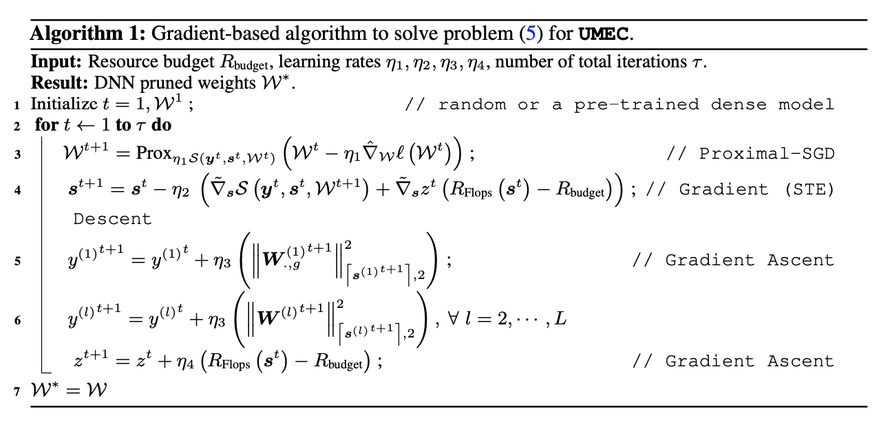
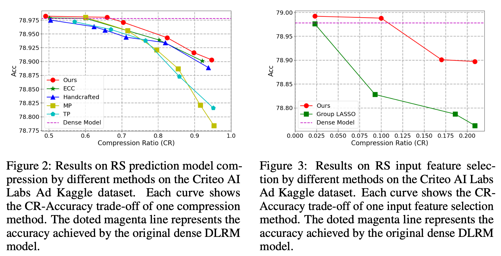

# UMEC: Unified Model and Embedding Compression for Efficient Recommendation Systems

[](https://opensource.org/licenses/MIT)

Code for this paper [UMEC: Unified Model and Embedding Compression for Efficient Recommendation Systems]()

Jiayi Shen, Haotao Wang\*, Shupeng Gui*, Jianchao Tan, Zhangyang Wang, and Ji Liu

## Overview

We propose a unified model and embedding compression (UMEC) framework to hammer an efficient neural network-based recommendation system. Our framework jointly learns input feature selection and neural network compression together, and solve them as an end-to-end resource-constrained optimization problem using ADMM.



## Main Results



## Implementation 

We perform the compression process on [DLRM](https://github.com/facebookresearch/dlrm), which is a public recommendation model.  Our proposed algorithm is mainly implemented in`rc_optimizer.py` and `rc_utils.py`. Other files are inherited from the original [DLRM](https://github.com/facebookresearch/dlrm) code repo, with several lines of modifications, such as `joint_train.py`, `input_selection.py`, and `finetune.py`, in order to plug in our algorithm. To run the code in this repo, you have to first follow the instructions in the original repo to download the dataset, and run the corresponding training part, to finish the data preprocessing process. 

### Unified Framework

To implement to joint training and compressing under the resource constraint, please see the script in `script/joint_train.sh`.

### Input feature selection

To implement to joint training and compressing under the resource constraint, please see the script in `script/input_selection.sh`.

## Acknowledgement

We thank the author of [DLRM](https://github.com/facebookresearch/dlrm) for providing a recommendation model benchmark.

## Citation

```
@inproceedings{
shen2021umec,
title={{\{}UMEC{\}}: Unified model and embedding compression for efficient recommendation systems},
author={Jiayi Shen and Haotao Wang and Shupeng Gui and Jianchao Tan and Zhangyang Wang and Ji Liu},
booktitle={International Conference on Learning Representations},
year={2021},
url={https://openreview.net/forum?id=BM---bH_RSh}
}
```

